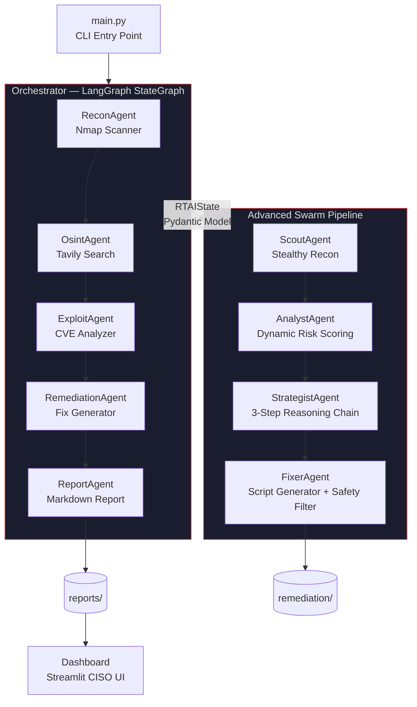

# **RTAI — Autonomous Red Team AI**

[](https://python.org)
[](https://github.com/langchain-ai/langgraph)
[](https://openai.com)
[](https://streamlit.io)
[](#legal-notice)

> **From zero to full CVE-grounded pentest report — fully autonomously.**

---

## What It Does

RTAI is a **multi-agent red team AI framework** that autonomously orchestrates a complete penetration-testing pipeline. Point it at an authorised target, and a coordinated swarm of specialised AI agents will:

1. **Enumerate** the target with stealth-optimised Nmap scanning (SYN-stealth when root, TCP-connect otherwise)
2. **Research** every discovered service against live CVE feeds via Tavily OSINT
3. **Analyse** findings with a CVE database and Dynamic Risk Scoring formula (CVSS × reachability + exploit bonuses)
4. **Plan** a multi-stage attack path with realistic ATT&CK-mapped techniques
5. **Generate** executable Bash patches, IPTables rules, and Ansible playbooks — with a safety filter that catches disruptive operations before they reach the operator
6. **Deliver** a publication-ready Markdown report and render it in an interactive CISO dashboard

Every output is grounded in structured state data. Tables and findings are built deterministically in Python — the LLM only writes narrative prose, eliminating hallucinated CVEs or risk ratings.

---

## Architecture



All agents share a single `RTAIState` Pydantic model. Findings accumulate across nodes using LangGraph's `operator.add` reducer — every agent appends its output rather than overwriting, creating a complete, auditable engagement record.

---

## Tech Stack

| Layer | Technology | Purpose |
|---|---|---|
| LLM Backbone | OpenAI GPT-4o via LangChain | Reasoning, analysis, narration |
| Agent Orchestration | LangGraph StateGraph | Linear and conditional pipeline management |
| Shared State | Pydantic v2 BaseModel | Typed, validated state passed between all agents |
| Network Recon | python-nmap + Scapy (optional) | Active host discovery and service scanning |
| OSINT | Tavily Search API | Live CVE / vulnerability research |
| CVE Analysis | Custom CveDatabase engine | Dynamic Risk Scoring with CVSS × reachability formula |
| Configuration | python-dotenv | Secret-free environment variable management |
| Dashboard | Streamlit + Plotly + streamlit-agraph | Interactive CISO reporting UI |
| Remediation Output | Bash + Ansible YAML | Copy-paste ready fix scripts with safety filters |
| Notifications | Telegram Bot API | Real-time mobile engagement alerts |
| Presentation | python-pptx | Automated dark-themed slide deck generation |

---

## Key Features

| Capability | Detail |
|---|---|
| Dual pipeline | Legacy 5-agent (recon→report) and advanced 4-agent swarm (scout→fixer) |
| CVE-grounded findings | Every risk rating derived from real CVSS scores — never hallucinated |
| Dynamic Risk Score | `min(10.0, cvss × reachability + exploit_bonus + auth_bypass_bonus)` |
| Safety filter | Catches reboot, critical service restarts, and blanket firewall flushes before execution |
| Human-in-the-loop | Approval gate blocks all fix deployment until operator confirms |
| Maintenance-window guard | High-traffic port restarts (DNS, HTTP/S) restricted to 02:00–05:00 UTC |
| Deterministic reporting | Tables and port data built from typed Python state; LLM writes prose only |
| DRY_RUN mode | Preview all proposed fixes without applying any changes |
| Full audit trail | Timestamped `action_log` for every agent event across the engagement |

---

## Setup

### Prerequisites

- Python 3.10+
- `nmap` binary on PATH: `sudo apt install nmap`
- Docker & Docker Compose *(Optional)*
- OpenAI API key
- Tavily API key *(free tier available)*

---

### 🐳 Run with Docker (Recommended)

You can launch the entire RTAI Swarm and CISO Dashboard using Docker without installing local dependencies.

Clone the repository and configure your `.env` file (see steps 1 & 4 below).

Run Docker Compose:

```bash
docker-compose up --build
```

Open your browser and navigate to `http://localhost:8501` to view the dashboard.

---

### 💻 Standard Installation (Local Environment)

```bash
# 1. Clone
git clone git@github.com:CyberSentinel-sys/RTAI.git
cd RTAI

# 2. Create virtual environment
python3 -m venv .venv
source .venv/bin/activate      # Windows: .venv\Scripts\activate

# 3. Install dependencies
pip install -r requirements.txt

# 4. Configure secrets
cp .env.example .env
# Edit .env and add your OPENAI_API_KEY and TAVILY_API_KEY
```

---

### Environment Variables

| Variable | Description | Required |
|---|---|---|
| `OPENAI_API_KEY` | OpenAI API key | Yes |
| `TAVILY_API_KEY` | Tavily search API key | Yes |
| `TARGET_SCOPE` | Authorised target — IP, hostname, or CIDR | Yes |
| `LLM_MODEL` | Model name (default: `gpt-4o`) | No |
| `LLM_TEMPERATURE` | Sampling temperature (default: `0.2`) | No |
| `ENGAGEMENT_NAME` | Label used in report filename (default: `RTAI_Engagement`) | No |
| `TELEGRAM_BOT_TOKEN` | Telegram bot token for alerts | No |
| `TELEGRAM_CHAT_ID` | Telegram chat ID for alerts | No |
| `SCAN_SELF` | Include localhost and LAN IP in scan (`true`/`false`) | No |

---

## Usage

### Run the Pipeline

```bash
# Standard scan (TCP connect, no root required)
.venv/bin/python main.py --target <TARGET> --engagement "My_Lab"

# Stealth scan with OS detection (SYN scan requires root)
sudo .venv/bin/python main.py --target <TARGET> --engagement "My_Lab"
```

### Examples

```bash
# Single host
.venv/bin/python main.py --target 192.168.1.10 --engagement "Lab_Q1"

# CIDR subnet (auto-discovers live hosts via ARP sweep, then scans only them)
sudo .venv/bin/python main.py --target 10.0.0.0/24 --engagement "Internal_Assessment"
```

The report is saved to `reports/<engagement>_<date>_report.md` and printed to stdout.

---

### Launch the CISO Dashboard

```bash
.venv/bin/streamlit run dashboard.py
# → http://localhost:8501
```

| Panel | Description |
|---|---|
| CISO Overview | Metric cards (Critical / High / Medium / Low) + grouped bar chart across all engagements |
| Swarm Live Feed | Real-time action log viewer |
| Network Map | streamlit-agraph force-directed host/service graph |
| Remediation | `Proposed_Fixes.sh` with syntax highlighting + DRY-RUN and Apply controls |
| Executive Report | Full Markdown report rendered in a scrollable dark panel |

---

### Generate a Presentation Deck

```bash
python generate_pptx.py
# → RTAI_LinkedIn_Presentation.pptx  (5-slide dark-themed deck)
```

---

## Project Structure

```plaintext
RTAI/
├── agents/
│   ├── base_agent.py          # Abstract base; ChatOpenAI wrapper + action logging
│   ├── recon_agent.py         # Nmap scan + LLM attack-surface analysis
│   ├── osint_agent.py         # Tavily OSINT + top-3 high-risk CVE synthesis
│   ├── exploit_agent.py       # Attack vector ranking (CVSS-grounded)
│   ├── remediation_agent.py   # Per-vector steps, code snippets, verification
│   ├── report_agent.py        # Structured Markdown report generation
│   ├── scout_agent.py         # Two-phase stealth recon (ARP sweep + Nmap)
│   ├── analyst_agent.py       # CVE cross-reference + Dynamic Risk Scoring
│   ├── strategist_agent.py    # 3-step LLM reasoning: triage → path → battle plan
│   └── fixer_agent.py         # Script gen + Safety Filter + ServiceImpactAnalyzer
├── core/
│   ├── config.py              # dotenv loader + startup validation
│   ├── state.py               # Pydantic RTAIState (shared across all nodes)
│   └── orchestrator.py        # LangGraph StateGraph (5-node linear pipeline)
├── tools/
│   ├── tool_base.py           # Abstract BaseTool interface
│   ├── tool_registry.py       # Singleton tool registry
│   └── nmap_wrapper.py        # python-nmap → structured dict output
├── samples/
│   └── sample_report.md       # Example output — fictional target
├── docs/                      # HTML landing page
├── .streamlit/
│   └── config.toml            # Dark theme configuration
├── dashboard.py               # Streamlit CISO dashboard (~60 KB)
├── generate_pptx.py           # Generates LinkedIn presentation deck
├── main.py                    # CLI entry point
├── Dockerfile                 # Docker container instructions
├── docker-compose.yml         # Multi-container orchestrator config
├── requirements.txt
├── .env.example               # Secret-free environment template
└── .gitignore
```

---

## Extending RTAI

### Adding a New Tool

Create `tools/my_tool.py` subclassing `BaseTool`:

```python
from tools.tool_base import BaseTool

class MyTool(BaseTool):
    name = "my_tool"
    description = "Does something useful."

    def run(self, **kwargs):
        return {"result": ...}
```

Register in `tools/tool_registry.py` inside `ToolRegistry.default()`:

```python
from tools.my_tool import MyTool
cls._instance.register(MyTool())
```

### Upgrading the CVE Database

Subclass `CveDatabase` in `analyst_agent.py` and override `lookup()` to call the NVD API or any live feed:

```python
class NvdCveDatabase(CveDatabase):
    def lookup(self, product: str, version: str) -> list[CveRecord]:
        # Call NVD API and map results to CveRecord TypedDicts
        ...
```

---

## Sample Output

`samples/sample_report.md` contains a complete mock report generated against a fictional target (`192.0.2.10`) showing the full output format — port tables, CVE findings, OSINT synthesis, attack vectors, remediation plan, and executive summary.

---

## Legal Notice

This tool is intended exclusively for use against systems you own or have explicit written authorisation to test. Unauthorised use is illegal and unethical. The authors accept no liability for misuse.

---

## License

For authorised security testing and research use only.
