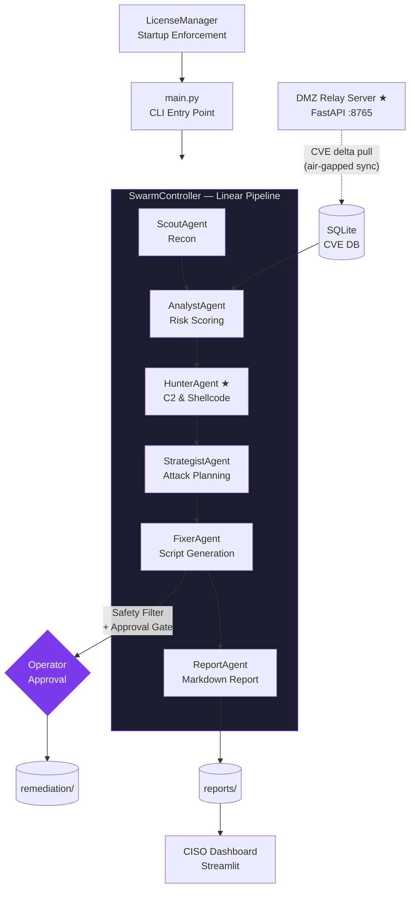

# RTAI — The Autonomous Air-Gapped Purple Team


[](https://python.org)
[](https://github.com/langchain-ai/langgraph)
[](#enterprise-edge)
[](#quickstart)
[](#legal-notice)

> **Autonomous Vulnerability Discovery, Threat Hunting, and IT-Ops Remediation in a single 100% Offline Swarm.**

RTAI is a standalone, enterprise-grade **Autonomous Purple Team** platform. Deploy it on an air-gapped network, point it at an authorised target, and a coordinated swarm of specialised AI agents will autonomously execute the full kill chain — from initial reconnaissance through CVE-grounded exploitation analysis, memory-resident threat hunting, and production-safe remediation — delivering a publication-ready report with zero cloud dependency.

---

## Swarm Intelligence

RTAI's pipeline is composed of six purpose-built agents that operate as a linear swarm. Every agent shares a single typed `RTAIState` Pydantic model; findings accumulate across stages without overwriting, producing a complete, auditable engagement record.

```
Scout ──▶ Analyst ──▶ Hunter* ──▶ Strategist ──▶ Fixer ──▶ Report
```

\* HunterAgent requires an Enterprise license.

| Agent | Role | Key Output |
|---|---|---|
| **ScoutAgent** | Stealth host discovery + service enumeration | Open ports, OS fingerprints, service banners via Scapy ARP sweep + Nmap |
| **AnalystAgent** | CVE cross-reference + Dynamic Risk Scoring | Ranked `entry_points` list with `min(10.0, CVSS × reachability + exploit_bonus)` scores |
| **HunterAgent** ★ | Memory-resident C2 beacon & shellcode detection | Process memory scan results, beacon IOCs, shellcode signatures |
| **StrategistAgent** | ATT&CK-mapped multi-stage attack planning | Step-by-step battle plan ordered low-noise → high-impact with fallback options |
| **FixerAgent** | Production-safe remediation script generation | Bash patches, IPTables rules, and Ansible playbooks with a Safety Filter |
| **ReportAgent** | Deterministic, hallucination-free report assembly | Structured Markdown report saved to `reports/` — tables built from typed state, LLM writes prose only |

All agents share state through LangGraph's `operator.add` reducer. The `SwarmController` applies a human-in-the-loop **Approval Gate** after the Fixer completes — no remediation script executes until the operator confirms via the CISO Dashboard.

---

## The Enterprise Edge

| Feature | Community | Enterprise |
|---|:---:|:---:|
| Local LLM (Ollama / llama3) | ✔ | ✔ |
| Air-gapped SQLite CVE Database | ✔ | ✔ |
| SearchSploit / ExploitDB OSINT | ✔ | ✔ |
| Bash remediation scripts | ✔ | ✔ |
| Telegram approval-gate notifications | ✔ | ✔ |
| CISO Streamlit Dashboard | ✔ | ✔ |
| **Ansible playbook generation** | ✗ | ✔ |
| **Jira Cloud / Server integration** | ✗ | ✔ |
| **HunterAgent** (memory shellcode & C2 hunting) | ✗ | ✔ |
| **DMZ Relay Server** (air-gapped CVE delta sync) | ✗ | ✔ |
| **HIPAA / SOC 2 compliance mapping** | ✗ | ✔ *(Month 3)* |
| **Multi-tenancy & SaaS Dashboard** | ✗ | ✔ *(Month 3)* |

---

## QuickStart

### Prerequisites

- Python 3.10+
- `nmap` binary: `sudo apt install nmap`
- Ollama (air-gapped mode) **or** an OpenAI API key

### 1 — Install

```bash
git clone git@github.com:CyberSentinel-sys/RTAI.git
cd RTAI
python3 -m venv .venv && source .venv/bin/activate
pip install -r requirements.txt
cp .env.example .env
```

### 2 — Configure `.env`

```bash
# Offline / Air-Gapped (recommended for Enterprise deployments)
USE_LOCAL_LLM=true
LOCAL_LLM_MODEL=llama3
USE_LOCAL_OSINT=true

# Or cloud-connected
OPENAI_API_KEY=sk-...
TAVILY_API_KEY=tvly-...

# Required for all modes
TARGET_SCOPE=10.0.0.0/24
ENGAGEMENT_NAME=Internal_Q1
```

### 3 — Generate a License

```bash
# Community (free, offline, always available)
python scripts/generate_license.py
# → data/rtai.lic (Community tier)

# Enterprise (vendor-issued — contact your RTAI vendor for the signing secret)
python scripts/generate_license.py \
    --tier enterprise \
    --issued-to "ACME Corp" \
    --expires 2027-12-31
# → data/rtai.lic (Enterprise tier — unlocks Ansible, Jira, HunterAgent, DMZ Relay)
```

The license file is read at startup. Community mode activates automatically if `data/rtai.lic` is absent or invalid — the pipeline continues with Community features only.

### 4 — Run

```bash
# Standard scan
.venv/bin/python main.py --target 192.168.1.10 --engagement "Lab_Q1"

# Stealth SYN scan with OS detection (requires root)
sudo .venv/bin/python main.py --target 10.0.0.0/24 --engagement "Internal_Assessment"
```

The report is written to `reports/<engagement>_<date>_report.md` and printed to stdout.

### 5 — CISO Dashboard

```bash
.venv/bin/streamlit run dashboard.py
# → http://localhost:8501
```

### 6 — Install DevSecOps Pre-Push Hook

```bash
bash scripts/install_hooks.sh
```

Installs a three-stage pre-push gate: secrets scanner → forbidden file check → Python lint.

---

## Architecture



---

## Environment Variables

| Variable | Description | Required |
|---|---|---|
| `OPENAI_API_KEY` | OpenAI API key | Unless `USE_LOCAL_LLM=true` |
| `TAVILY_API_KEY` | Tavily search key | Unless `USE_LOCAL_OSINT=true` |
| `TARGET_SCOPE` | Authorised target — IP, hostname, or CIDR | Yes |
| `USE_LOCAL_LLM` | Use Ollama instead of OpenAI (`true`/`false`) | No |
| `LOCAL_LLM_MODEL` | Ollama model name (default: `llama3`) | No |
| `USE_LOCAL_OSINT` | Use searchsploit + SQLite instead of Tavily | No |
| `REMEDIATION_FORMAT` | `bash` (default) or `ansible` ★ | No |
| `ENABLE_JIRA_INTEGRATION` | Auto-create Jira tickets for top findings ★ | No |
| `JIRA_SERVER_URL` | Jira instance URL ★ | No |
| `JIRA_USER_EMAIL` | Jira account email ★ | No |
| `JIRA_API_TOKEN` | Jira API token ★ | No |
| `TELEGRAM_BOT_TOKEN` | Telegram bot token for mobile alerts | No |
| `TELEGRAM_CHAT_ID` | Telegram recipient chat ID | No |
| `ENGAGEMENT_NAME` | Report label (default: `RTAI_Engagement`) | No |
| `RTAI_LICENSE_FILE` | Override default `data/rtai.lic` path | No |

★ Enterprise license required.

---

## Project Structure

```
RTAI/
├── agents/
│   ├── base_agent.py          # Abstract base; LLM factory + action logging
│   ├── scout_agent.py         # Scapy ARP sweep + Nmap service scan
│   ├── analyst_agent.py       # CVE cross-reference + Dynamic Risk Scoring
│   ├── hunter_agent.py        # Memory shellcode & C2 beacon detection ★
│   ├── strategist_agent.py    # ATT&CK-mapped battle plan generation
│   ├── fixer_agent.py         # Bash/Ansible generation + Safety Filter
│   ├── report_agent.py        # Deterministic structured report assembly
│   └── swarm_controller.py    # Linear pipeline orchestrator + Approval Gate
├── core/
│   ├── config.py              # dotenv loader + feature flags
│   ├── state.py               # Pydantic RTAIState (shared across all agents)
│   ├── license_manager.py     # HMAC-SHA256 license engine + feature gating
│   └── orchestrator.py        # LangGraph StateGraph (legacy pipeline)
├── integrations/
│   └── jira_client.py         # Jira REST API v3 client (ADF ticket creation) ★
├── relay_server/
│   └── app.py                 # DMZ Relay FastAPI server (CVE delta sync) ★
├── tools/
│   ├── tool_base.py           # Abstract BaseTool
│   ├── tool_registry.py       # Singleton tool registry
│   └── nmap_wrapper.py        # python-nmap → structured dict output
├── scripts/
│   ├── generate_license.py    # Vendor-side license token generator
│   ├── install_hooks.sh       # DevSecOps pre-push hook installer
│   ├── pre_push_check.sh      # Pre-push: secrets / forbidden files / lint gate
│   └── sync_relay.py          # Air-gapped CVE delta sync client ★
├── data/
│   └── rtai.lic               # License file (gitignored — generate locally)
├── reports/                   # Generated engagement reports
├── remediation/               # Generated fix scripts and Ansible playbooks
├── main.py                    # CLI entry point
├── dashboard.py               # Streamlit CISO dashboard
├── requirements.txt
├── .env.example               # Secret-free environment template
├── ROADMAP.md                 # Product roadmap
└── .gitignore
```

---

## DMZ Relay Server (Air-Gapped CVE Sync)

For fully air-gapped deployments, the DMZ Relay Server maintains a continuously updated CVE feed on an internet-connected staging machine and exposes a pull-based REST API that the isolated RTAI node syncs from on demand.

```bash
# Start the relay (DMZ / internet-connected machine)
cd relay_server
pip install -r requirements.txt
uvicorn app:app --host 0.0.0.0 --port 8765

# Sync CVE deltas into the air-gapped node's local SQLite DB
python scripts/sync_relay.py --relay http://10.10.0.1:8765

# Delta sync (only CVEs updated since a date)
python scripts/sync_relay.py --relay http://10.10.0.1:8765 --since 2025-01-01

# Dry-run preview
python scripts/sync_relay.py --relay http://10.10.0.1:8765 --dry-run
```

---

## Legal Notice

This tool is intended exclusively for use against systems you own or have explicit written authorisation to test. Unauthorised use is illegal and unethical. The authors accept no liability for misuse.

---

## License

MIT — see `LICENSE`. Enterprise features require a valid `data/rtai.lic` license key.
